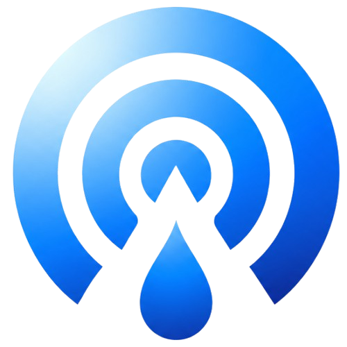

  

<h1 align="center">BeamDrop</h1>

Native private device transfer for Android, iPhone, Windows, and macOS.

BeamDrop is a native, private cross-device transfer app for trusted personal devices.
It is designed for moving files, folders, text, links, screenshots, and clipboard
content between Android, iPhone, Windows, and macOS without treating the cloud as
the default path.

BeamDrop is local-first. The primary product experience should work over nearby
networks and direct device-to-device paths where possible. Optional servers may be
used for relay or signaling, but BeamDrop should not require uploading user
content to a cloud storage service for the local MVP.

## Supported Platforms

- Android: Kotlin and Jetpack Compose
- iPhone: Swift and SwiftUI
- macOS: Swift, SwiftUI, and AppKit where native desktop integration is needed
- Windows: C#, WinUI 3, and Windows App SDK
- Shared core: Rust where it provides clear value for protocol, crypto, device
  discovery, transfer state, and cross-platform correctness

BeamDrop is not an Electron, Tauri, Flutter, React Native, Ionic, Cordova, web
wrapper, or browser-only application.

## Status

| Area | Status |
| --- | --- |
| Android |  |
| iPhone |  |
| macOS |  |
| Windows |  |
| Shared Rust core |  |
| Public downloads |  |

## Downloads

BeamDrop downloads are published through GitHub Releases:

[Download Latest BeamDrop Release](https://github.com/philwamba/beamdrop/releases/latest)

| Platform | Download | Notes |
| --- | --- | --- |
| Android | [APK releases](https://github.com/philwamba/beamdrop/releases) | Look for `BeamDrop-Android-*-internal.apk` and verify the matching `.sha256` file. |
| macOS | [DMG releases](https://github.com/philwamba/beamdrop/releases) | Look for `BeamDrop-macOS-*-internal.dmg` and verify the matching `.sha256` file. |
| iPhone | TestFlight / App Store | Planned; no iPhone public package is published yet. |
| Windows | MSIX / installer | Planned; no Windows public package is published yet. |

Current GitHub downloads are prerelease/internal testing artifacts unless a
release explicitly says otherwise. Android APKs are not Play Store signed yet.
macOS DMGs are not notarized yet.

Do not download BeamDrop from third-party mirrors. Use only the GitHub Releases
page for repository-published artifacts.

## Builds

BeamDrop is organized as a native monorepo. Each platform is built with its own
native toolchain.

| Target | Location | Command |
| --- | --- | --- |
| Android | `apps/android/` | `scripts/build-android.sh` |
| iPhone | `apps/ios/` | `scripts/build-ios.sh` |
| macOS | `apps/macos/` | `scripts/build-macos.sh` |
| Windows | `apps/windows/` | `pwsh scripts/build-windows.ps1` |
| Rust core | `core/beamdrop-core/` | `cargo test --workspace` |
| Optional servers | `server/beamdrop-*` | `pnpm test && pnpm build` |

Release automation lives under `.github/workflows/` and publishes generated
artifacts to GitHub Releases. Local `dist/` output is intentionally ignored by
git; release artifacts should be downloaded from GitHub Releases, not committed
to the repository.

## Releases

BeamDrop releases will follow this model:

- Development builds for internal testing.
- Alpha releases for local-network pairing and transfer validation.
- Beta releases for broader device compatibility testing.
- Production releases after signing, notarization, store review, and security
  checks are complete.

Every release should include:

- Platform-specific checksums.
- Build provenance.
- Security notes.
- Known limitations.
- Upgrade notes.
- Screenshots for the current platform UI.

## Screenshots

Screenshots will be added as the native apps stabilize.

Planned screenshot set:

- Android home, pairing, transfer progress, and history.
- iPhone onboarding, Share Sheet send flow, pairing, and receive approval.
- macOS menu bar, main window, pairing QR, and diagnostics.
- Windows main window, tray menu, transfer progress, and trusted devices.

Repository screenshot assets should be stored under `design/screenshots/` and
referenced from this README once the UI is ready for release-quality capture.

## Transfer Scope

BeamDrop is intended to support:

- Files and folders
- Text snippets
- Links
- Screenshots
- Clipboard content

Transfers should be explicit, inspectable, and controlled by the user. Trusted
device pairing, transport encryption, transfer integrity checks, and clear
receive/send consent are core product requirements.

## Clipboard Platform Constraints

iPhone clipboard sync cannot rely on silent background clipboard monitoring.
iOS does not allow apps to continuously read the clipboard in the background.
BeamDrop clipboard sending on iPhone must be manual through supported user-driven
entry points such as Share Sheet, Shortcuts, or Paste.

Android clipboard access is also subject to OS restrictions, especially in recent
Android versions. BeamDrop clipboard sending on Android must be user-triggered
where required by the operating system.

These constraints are product requirements, not implementation details. BeamDrop
must expose clipboard workflows that respect each platform's privacy model.

## Development Principles

- Native platform UI and OS integration come first.
- Local transfer should be the default path.
- Servers are optional infrastructure for signaling or relay, not mandatory cloud
  storage.
- Shared Rust code should be used where it reduces duplicated correctness,
  security, or protocol work.
- Platform privacy restrictions must be reflected in the product UX.

## Current Status

BeamDrop is under active MVP development. The repository contains product and
architecture documentation, protocol schemas and examples, shared Rust core
foundation, Android transfer work, Windows transfer work, and a native macOS app
foundation.

The project is not production-released yet. Public downloads will be added only
after release builds are signed, tested, documented, and transfer encryption plus
real-device cross-platform QA are complete.

---

© 2026 BeamDrop contributors. Released under the [MIT License](LICENSE).
